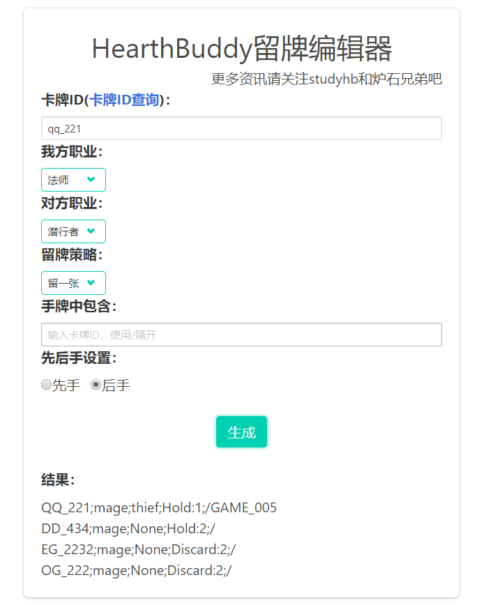

**This is HearthBuddy's online mulligan editor!**

*This repository can help you edit HearthBuddy mulligan, you can enter this url to use it.*

> *[https://magician333.github.io/hbmulligan/](https://magician333.github.io/hbmulligan/)*

New Future
---
1.clip code by click it！
2.mass production once！

Get HearthBuddy ?
---
Go HearthBuddy Tieba or StudyHb.cn

Get CardID ?
---
Go [Here](https://github.com/ChuckHearthstone/CardQuery), CardQuery is made by Chuck, It's convenient for search card id and card name !

Contact me ?
---
Sorry,  I don't like social intercourse.

from _PurpleFire_
